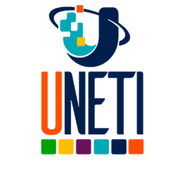

# Blog Interactivo: Inteligencia Artificial y su Impacto en Venezuela

## Descripción del Proyecto
Este proyecto consiste en la creación de un **blog interactivo** que explora el impacto de la **Inteligencia Artificial (IA)** en sectores clave de Venezuela, como la salud, la educación, la economía y la seguridad. El blog será desarrollado en una plataforma gratuita (WordPress, Blogger o Notion) y contendrá artículos, infografías y videos explicativos que faciliten la comprensión del tema.

El objetivo es ofrecer una visión clara y actualizada de cómo la IA está transformando estos sectores en el contexto venezolano, destacando tanto sus beneficios como sus desafíos.
 
---

## Autores
El proyecto fué desarrollado por un equipo de 5 estudiantes:
- **V30346056 Frederick Durán**
- **V16251597 Arturo Natera**
- **V12072593 Susan Molina** 
- **V11791224 Maria Antonieta Padilla**
- **V17705832 Johan González** 

---

  

## 📌 Actividad
Los estudiantes, organizados en equipos, deben diseñar un blog interactivo en una plataforma gratuita (WordPress, Blogger o Notion) donde expliquen el impacto de la inteligencia artificial en sectores clave de Venezuela (salud, educación, economía, seguridad). Se deben incluir:
- **Artículos** bien redactados y referenciados.
- **Infografías** que resuman información clave de manera visual.
- **Videos explicativos** que complementen el contenido escrito.

---

## 📌 Metodología
El proyecto se desarrollará bajo la siguiente metodología:
1. **Trabajo colaborativo en línea**: Los integrantes del equipo trabajarán de manera coordinada utilizando herramientas digitales para la comunicación y gestión de tareas.
2. **Uso de herramientas digitales**: Se emplearán herramientas para la redacción, diseño gráfico y edición de multimedia.
3. **Aprendizaje basado en proyectos (ABP)**: El enfoque práctico permitirá a los estudiantes aplicar sus conocimientos teóricos en la creación de un producto tangible.

---

## 📌 Ponderación
El proyecto tiene un valor de **3 puntos** en la evaluación final.

---

## 📌 Criterios de Evaluación
El blog será evaluado según los siguientes criterios:
1. **Contenido de calidad**: Artículos bien investigados, con referencias actualizadas y fuentes confiables.
2. **Diseño y creatividad**: Presentación visual atractiva y profesional, con un diseño intuitivo y fácil de navegar.
3. **Uso de multimedia**: Integración efectiva de videos, imágenes e infografías que complementen el contenido.
4. **Participación equitativa**: Contribución activa y balanceada de todos los integrantes del equipo.

---

## 📅 Fecha Límite
El proyecto debe ser entregado el **21 de febrero a las 6:59 p.m.**

---

## 🚦 Estado del Proyecto
**Estado:** ⏳ **En Progreso**

---

## Estructura del Blog
El blog estará organizado en las siguientes secciones:
1. **Inicio**: Presentación del blog y resumen de los temas tratados.
2. **Salud**: Impacto de la IA en el sector salud (ej: diagnóstico médico, telemedicina).
3. **Educación**: Aplicaciones de la IA en la educación (ej: plataformas de aprendizaje adaptativo).
4. **Economía**: Influencia de la IA en la economía venezolana (ej: automatización, fintech).
5. **Seguridad**: Uso de la IA en la seguridad ciudadana y ciberseguridad.
6. **Recursos**: Infografías, videos y enlaces de interés.

---

## Herramientas Utilizadas
- **Plataforma del blog**: WordPress, Blogger o Notion.
- **Diseño gráfico**: Canva, Adobe Spark o Figma para infografías.
- **Edición de video**: CapCut, iMovie o DaVinci Resolve.
- **Gestión de proyecto**: Trello, Notion o Google Docs para organización y colaboración.

---

## Contribuciones
Cada integrante del equipo tendrá asignadas tareas específicas, asegurando una participación equitativa. Las responsabilidades incluyen:
- Investigación y redacción de artículos.
- Diseño de infografías y contenido visual.
- Grabación y edición de videos.
- Revisión y corrección de contenido.

---

## Referencias
Se utilizarán fuentes confiables y actualizadas, como:
- Artículos académicos y publicaciones especializadas.
- Noticias y reportajes recientes sobre IA.
- Datos oficiales y estudios de caso relevantes para Venezuela.

---

## Notas Finales
Este proyecto no solo busca cumplir con los requisitos académicos, sino también generar un recurso educativo valioso para el público interesado en el impacto de la inteligencia artificial en Venezuela. ¡Esperamos que el resultado final sea informativo, creativo y de alta calidad!